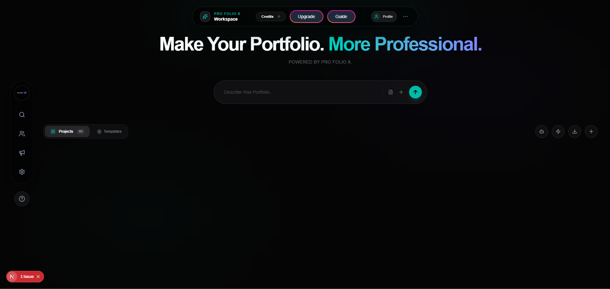
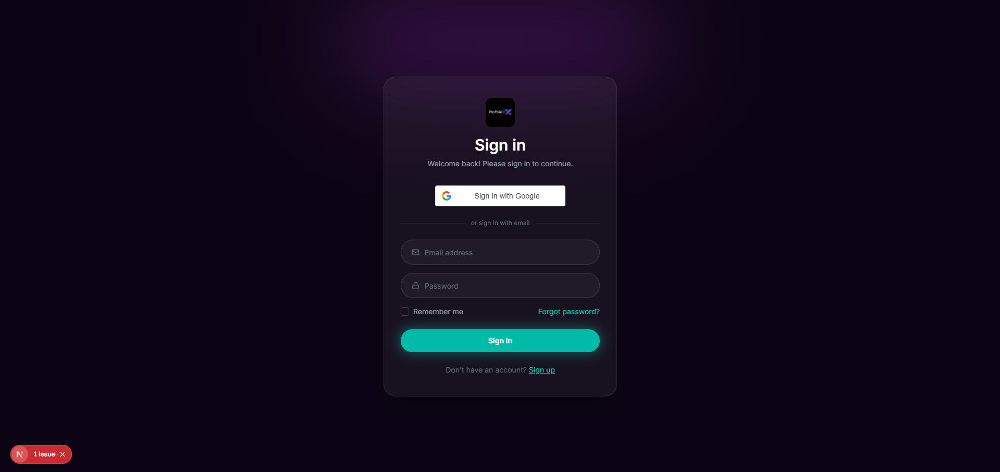
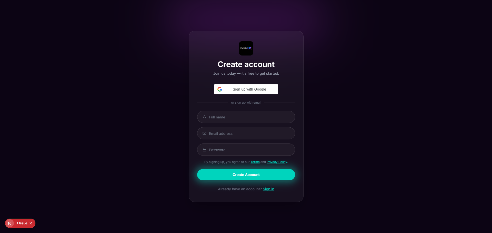

# ProFolioX - AI-Powered Portfolio Builder


ProFolioX is a premium, AI-driven SaaS platform designed to help developers and creators build stunning, professional portfolios in seconds. By leveraging the power of the Gemini AI and a sleek, glassmorphic design system, ProFolioX transforms your experience into a polished web presence.

## 🚀 Features

- **AI Generation**: Generate complete portfolio content (Bio, Skills, Projects) using Google's Gemini AI from just a few prompts or a resume upload.
- **Freemium SaaS Model**: Integrated credit-based system. Start for free with 5 credits, or upgrade to Premium for 50+ credits and exclusive templates.
- **Secure Payments**: Fully integrated with **Razorpay** for seamless, secure plan upgrades.
- **Dynamic Templates**: Choose from a variety of premium, responsive templates tailored for different roles.
- **Glassmorphic UI**: A state-of-the-art interface featuring vibrant gradients, subtle micro-animations, and a premium dark mode aesthetic.
- **Google OAuth**: One-tap secure login with Google integration.

## 🛠️ Tech Stack

**Frontend:**
- Next.js 14+
- Tailwind CSS (Vanilla CSS for custom components)
- Framer Motion (for high-end animations)
- Axios & React Hot Toast

**Backend:**
- Node.js & Express
- Prisma ORM
- PostgreSQL (Supabase/Neon)
- Razorpay SDK
- JWT Authentication

## 📸 Screenshots

<div align="center">
  
  
</div>
<div align="center">
  
  
</div>

## 🏁 Getting Started

### 1. Clone the repository
```bash
git clone https://github.com/yourusername/profoliox.git
cd profoliox
```

### 2. Backend Setup
```bash
cd profoliox-server
npm install
```
Create a `.env` file in `profoliox-server`:
```env
DATABASE_URL=your_postgresql_url
SECRET_KEY=your_jwt_secret
GEMINI_API_KEY=your_google_ai_key
RAZORPAY_API_ID=your_razorpay_key
RAZORPAY_KEY_SECRET=your_razorpay_secret
```
Run migrations:
```bash
npx prisma db push
npm run dev
```

### 3. Frontend Setup
```bash
cd profoliox
npm install
```
Create a `.env.local` file in `profoliox`:
```env
NEXT_PUBLIC_BASE_URL=http://localhost:5000
NEXT_PUBLIC_GOOGLE_CLIENT_ID=your_google_client_id
NEXT_PUBLIC_RAZORPAY_KEY_ID=your_razorpay_key_id
```
Start the development server:
```bash
npm run dev
```

## 📜 License
This project is licensed under the MIT License.

